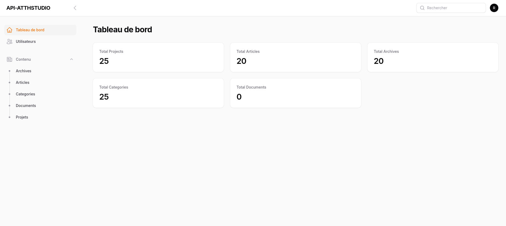
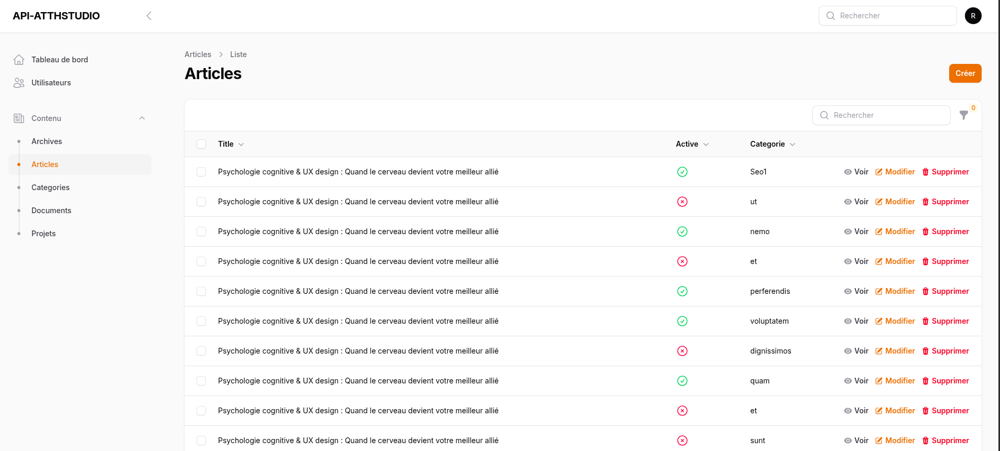

<h1 align="center">
  API-ATTHSTUDIO
</h1>

### View

<p>API et BackOffice pour AtthStudio</p>




### 🛠 Installation & Set Up

1. Install dependencies

```sh
composer install
```

2. Run migration and factory

```sh
./vendor/bin/sail migrate
```

```sh
./vendor/bin/sail artisan migrate:fresh --seed
```

3. Start the development server

```
./vendor/bin/sail up
```

4. Access the API

```
http://127.0.0.1:8001
```

### 📚 Documentation

[API Documentation](https://api-atthstudio.up.railway.app/api/documentation)

[BackOffice](https://api-atthstudio.up.railway.app/admin)

[Demo](https://api-atthstudio.up.railway.app/admin)

user: demo@gmail.com
password: demo@gmail.com